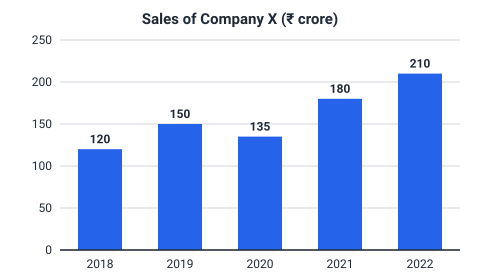
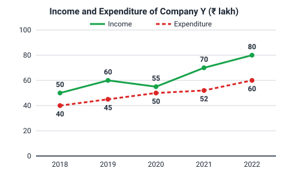
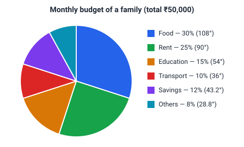

# Data Interpretation

## Concept

**Data Interpretation (DI)** gives you data — as a table, graph, chart or paragraph — and asks questions that need reading the right values and calculating with them. The mathematics is almost always [percentages](../percentages/content.md), [ratios](../ratio-and-proportion/content.md) and [averages](../averages/content.md); the real test is **speed and accuracy in reading and approximating**.

A dependable approach for every DI set:

1. **Read the frame first** — title, units (₹ lakh, thousands, %), years, what each row/axis/sector means.
2. **Read the question, then go to the data** — pick only the values you need.
3. **Estimate before calculating** — if the options are far apart, an approximation is enough.
4. **Watch the base** — "percentage increase from 2020 to 2021" divides by the 2020 value.

### Calculations used in DI

```text
Percentage change   = (New − Old) / Old × 100
Percentage share    = Part / Total × 100
Ratio               = A : B (simplify)
Average             = Sum / Count
Pie: central angle  = (Part / Total) × 360°     Value = (angle / 360°) × Total
```

### Approximation techniques

- Round to friendly numbers: 487/1,210 ≈ 490/1,225 = 0.4 → about 40%.
- Use the [fraction table](../percentages/content.md#fraction-equivalents): 1/8 = 12.5%, 1/6 = 16.67%, 1/7 ≈ 14.29%.
- Compare fractions by cross-multiplication instead of dividing: 18/52 vs 15/45 → 18 × 45 = 810 vs 15 × 52 = 780 → 18/52 is larger.
- Only compute exactly when the options are close.

## Tables

### Reading tables

Tables give exact values. Questions combine rows and columns: totals, averages, growth, ratios.

**Production of a factory (thousand units):**

| Year | Cars | Bikes | Trucks |
|------|------|-------|--------|
| 2019 | 40 | 120 | 15 |
| 2020 | 45 | 110 | 18 |
| 2021 | 50 | 132 | 20 |
| 2022 | 60 | 150 | 24 |

### Typical questions

- **Growth:** cars grew from 40 to 60 → (20/40) × 100 = 50%.
- **Average:** bikes = (120 + 110 + 132 + 150)/4 = 512/4 = 128 thousand.
- **Ratio:** trucks in 2020 : 2022 = 18 : 24 = 3 : 4.
- **Maximum total:** row totals 175, 173, 202, 234 → 2022.

> [!TIP]
> Add a mental "Total" column only when questions need it — computing every total in advance wastes time.

## Bar Graphs

### Reading bar graphs

Each bar's height is a value. Read the value from the label (if given) or the axis. Bar graphs make comparisons and changes easy to see.



| Year | 2018 | 2019 | 2020 | 2021 | 2022 |
|------|------|------|------|------|------|
| Sales (₹ crore) | 120 | 150 | 135 | 180 | 210 |

### Typical questions

- **Percentage increase 2021 → 2022:** 30/180 × 100 = 16.67%.
- **Average sales:** 795/5 = ₹159 crore.
- **Highest percentage growth:** 2019 +25%, 2020 −10%, 2021 +33.33%, 2022 +16.67% → **2021**.

> [!WARNING]
> The biggest **absolute** increase and the biggest **percentage** increase are often in different years. Read which one is asked.

## Line Graphs

### Reading line graphs

Line graphs show trends over time. A steeper segment means a faster change. With two lines, the vertical gap is the difference between them (e.g. profit = income − expenditure).



| Year | 2018 | 2019 | 2020 | 2021 | 2022 |
|------|------|------|------|------|------|
| Income (₹ lakh) | 50 | 60 | 55 | 70 | 80 |
| Expenditure (₹ lakh) | 40 | 45 | 50 | 52 | 60 |

### Typical questions

- **Profit each year** (income − expenditure): 10, 15, 5, 18, 20.
- **Profit percentage on expenditure:** 25%, 33.33%, 10%, 34.62%, 33.33% → highest in **2021**, although the highest profit amount is in 2022.
- **Year income fell:** 2020 (60 → 55).

## Pie Charts

### Reading pie charts

A pie chart shows how a total is divided. Sectors are given as percentages or as angles (the whole circle is 360°, so 1% = 3.6°).



| Head | Food | Rent | Education | Transport | Savings | Others |
|------|------|------|-----------|-----------|---------|--------|
| Share | 30% | 25% | 15% | 10% | 12% | 8% |
| Angle | 108° | 90° | 54° | 36° | 43.2° | 28.8° |

### Typical questions

- **Amount for a head:** education = 15% of 50,000 = ₹7,500.
- **Difference:** food − transport = 20% of 50,000 = ₹10,000.
- **Central angle:** savings = 12 × 3.6 = 43.2°.
- **Ratio:** rent : education = 25 : 15 = 5 : 3 (no need for rupee values).

> [!TIP]
> Compare sectors in percentages and convert to money only for the final answer.

## Caselet DI

### Reading caselets

A **caselet** presents data in a paragraph. The skill is converting the text into a small table before answering — every question then becomes a table question.

**Caselet:** A college has 1,200 students in Science, Commerce and Arts in the ratio 5 : 4 : 3. 40% of Science students are girls. Commerce has 180 girls. Arts has equal numbers of boys and girls.

**Step 1 — build the table:**

| Stream | Total | Girls | Boys |
|--------|-------|-------|------|
| Science | 500 | 200 | 300 |
| Commerce | 400 | 180 | 220 |
| Arts | 300 | 150 | 150 |
| **Total** | **1,200** | **530** | **670** |

### Typical questions

- **Percentage of girls overall:** 530/1,200 × 100 ≈ 44.17%.
- **Ratio of boys in Science to Commerce:** 300 : 220 = 15 : 11.
- **Stream with the highest share of girls:** Arts (50%) vs Commerce (45%) vs Science (40%) → Arts.

> [!IMPORTANT]
> Build the table once, carefully. A single wrong cell spoils every question in the set.

## Common Mistakes

- Ignoring units (thousands vs lakhs vs crores) or the scale of an axis.
- Dividing by the new value in percentage change.
- Confusing absolute change with percentage change.
- In pie charts, mixing up percentages and degrees.
- Misreading a caselet sentence ("40% of Science students are girls" is not "40% of girls are in Science").

## Placement Tips

- Skim all questions of a set first; group those that need the same values.
- Approximate when options differ by more than about 5%; compute exactly only when they are close.
- If a set looks long and calculation-heavy, attempt easier sets first — DI sets are independent.
- Keep the fraction-percentage table at your fingertips; it removes most divisions.

## Key Takeaways

- Read titles, units and labels before the questions.
- DI is percentages, ratios and averages applied to data — watch the base.
- Pie charts: 1% = 3.6°; value = angle/360 × total.
- Caselets: convert the paragraph into a table first.
- Estimate first; calculate exactly only when options are close.
